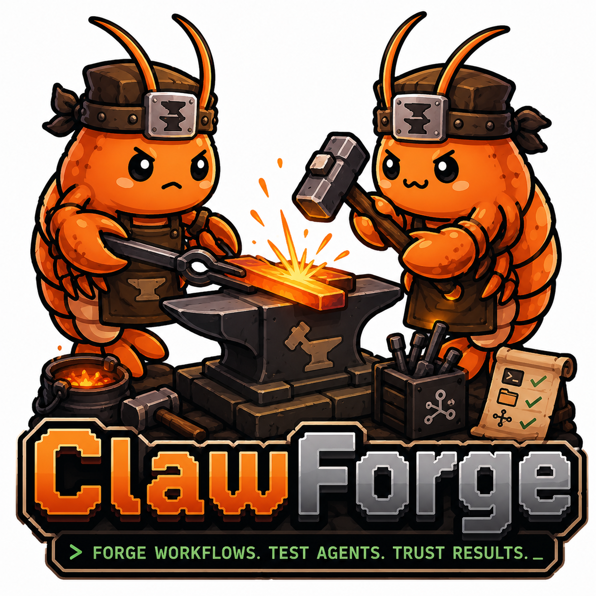
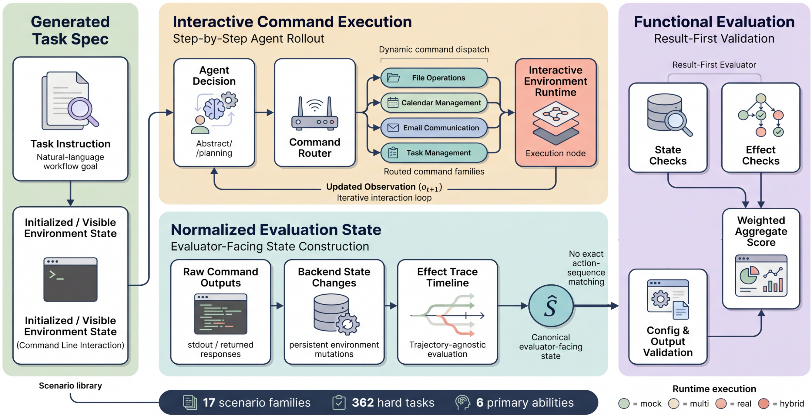

<p align="center">
  
</p>

<div align="center">

# Generating Executable Interactive Benchmarks for Command-Line Agents

ClawForge is an interactive benchmark for CLI-style agents. It measures whether an agent can inspect persistent workflow state, issue commands step by step, and complete tasks through correct state changes and observable side effects.

[](LICENSE)
[](docs/hard-benchmark.md)
[](docs/hard-benchmark.md)
[](docs/release-snapshot.md)
[](https://arxiv.org/abs/2605.14133)

[Quick Start](#quick-start) · [Evaluation](docs/evaluation.md) · [Execution Modes](docs/execution-modes.md) · [OpenClaw Setup](docs/openclaw-setup.md) · [Task Generation](docs/task-generation.md) · [Docs Index](docs/README.md)

</div>

---

## Overview

ClawForge is for teams that need to evaluate execution-time behavior rather than a single final answer. The current flagship family, `hard_decision_workflow`, focuses on partial state, branch selection, state repair, replacement, duplicate avoidance, and workflow closure.

The checked-in release snapshot currently includes:

- `17` hard scenarios
- `362` hard tasks in `hard_decision_workflow`
- `1616` total tasks across the broader repository snapshot
- default split files for `train`, `dev`, and `test`

These are documented release counts, not fixed generator ceilings. The underlying benchmark is generator-backed, and release profiles can be regenerated with different per-scenario counts while keeping task semantics and evaluator contracts stable.

---

## What ships in this repo

The public repository surface is organized around runnable benchmark code rather than paper artifacts.

- `openclaw_env/`: environment, task schema, generators, evaluation logic, and checked-in benchmark data
- `examples/`: primary evaluation entrypoint
- `scripts/`: task generation and maintainer utilities
- `tests/`: regression coverage for generation, runtime, and CLI behavior
- `docs/`: user-facing and maintainer-facing documentation

See [docs/release-snapshot.md](docs/release-snapshot.md) for what is treated as a checked-in release artifact versus what can be regenerated locally.

---

## Quick Start

Install from the repository root:

```bash
pip install -e .
pip install -e ".[dev]"
```

Generate the benchmark snapshot:

```bash
python scripts/generate_tasks.py
```

Run a first hard-benchmark evaluation:

```bash
python examples/train_and_eval.py \
  --agent llm \
  --llm-provider openai \
  --llm-base-url https://api.example.com/v1 \
  --model Kimi-K2.5 \
  --task-prefix hard_decision_workflow_ \
  --split test \
  --mode multi \
  --max-steps 20 \
  --llm-max-tokens 192 \
  -v
```

The benchmark-facing protocol above is intentional. The CLI default step budget is lower (`15`), so benchmark comparisons should set `--max-steps` explicitly.

For a longer first-run path, LiteLLM-backed Claude examples, and structured report flags, see [docs/quickstart.md](docs/quickstart.md).

---

## Execution Modes

ClawForge supports four execution modes:

- `mock`: narrow in-process simulation for tests and simple backend checks
- `multi`: routed local execution across the benchmark's app-family backends; default benchmark mode
- `real`: real `openclaw` CLI subprocess path for `openclaw *` commands
- `hybrid`: live OpenClaw gateway plus the routed local skill stack

`multi` is the default public benchmark mode because it preserves interactive state across command families while remaining reproducible and inexpensive to run.

See [docs/execution-modes.md](docs/execution-modes.md) for exact backend behavior and [docs/openclaw-setup.md](docs/openclaw-setup.md) for `real` and `hybrid` prerequisites.

---

## Running Evaluations

The primary evaluation entrypoint is:

```bash
python examples/train_and_eval.py
```

Typical outputs include:

- full-pass accuracy
- partial-credit average score
- scenario-level and ability-level summaries
- provider-aware fields such as `provider_failures` and `provider_impacted_tasks`

See [docs/evaluation.md](docs/evaluation.md) for common commands, history modes, and output interpretation.

---

## Task Generation

ClawForge benchmark artifacts are generator-backed. The standard regeneration command is:

```bash
python scripts/generate_tasks.py
```

Generated outputs are written under `openclaw_env/data/{tasks,datasets}` unless `--output-data-dir` is used.

The current hard release is one official profile rather than a hard-coded maximum. You can adjust the shared hard-scenario count or override individual scenarios without changing the underlying benchmark semantics.

<p align="center">
  
</p>

See [docs/task-generation.md](docs/task-generation.md) for generation flags and [docs/hard-benchmark.md](docs/hard-benchmark.md) for the current scenario inventory.

---

## Hard Benchmark

`hard_decision_workflow` is the most benchmark-focused suite in the repository. It is built around six recurring ability buckets:

- `duplicate_avoidance`
- `gap_completion`
- `information_transfer`
- `multi_source_reasoning`
- `state_repair`
- `workflow_completion`

For the current official hard profile, scenario slugs, and evaluator framing, see [docs/hard-benchmark.md](docs/hard-benchmark.md).

<p align="center">
  
</p>

---

## Results Snapshot

This repository includes a documented release snapshot of benchmark results. It is not a live leaderboard and should be read together with the benchmark configuration, execution mode, and provider caveats described in the docs.

<p align="center">
  
</p>

Additional benchmark composition and result-context figures are documented in [docs/results.md](docs/results.md).

---

## Limitations

ClawForge is not a generic shell benchmark and not a continuously refreshed model leaderboard.

- The checked-in release snapshot reflects one documented data profile, not every possible generator configuration.
- `multi` is the default benchmark mode; `real` and `hybrid` require extra OpenClaw runtime setup.
- This repository hardening pass does not refresh or regenerate the current dirty `openclaw_env/data/...` worktree contents.
- Interactive results can still be affected by provider behavior such as retries, filtered responses, or endpoint instability.

---

## Docs

Start with [docs/README.md](docs/README.md) for goal-oriented routing:

- Run the benchmark:
  - [docs/quickstart.md](docs/quickstart.md)
  - [docs/evaluation.md](docs/evaluation.md)
  - [docs/execution-modes.md](docs/execution-modes.md)
- Understand the hard suite:
  - [docs/hard-benchmark.md](docs/hard-benchmark.md)
  - [docs/results.md](docs/results.md)
  - [docs/clawforge-data-and-scenarios-overview.md](docs/clawforge-data-and-scenarios-overview.md)
- Set up OpenClaw-backed modes:
  - [docs/openclaw-setup.md](docs/openclaw-setup.md)
  - [docs/execution-modes.md](docs/execution-modes.md)
- Regenerate release artifacts:
  - [docs/task-generation.md](docs/task-generation.md)
  - [docs/release-snapshot.md](docs/release-snapshot.md)
- Develop locally:
  - [docs/project-structure.md](docs/project-structure.md)
  - [CONTRIBUTING.md](CONTRIBUTING.md)

---

## Citation

If you use ClawForge, cite both the repository and the accompanying paper.

```bibtex
@misc{lai2026clawforgegeneratingexecutableinteractive,
      title={ClawForge: Generating Executable Interactive Benchmarks for Command-Line Agents}, 
      author={Yuxiang Lai and Peng Xia and Haonian Ji and Kaiwen Xiong and Kaide Zeng and Jiaqi Liu and Fang Wu and Jike Zhong and Zeyu Zheng and Cihang Xie and Huaxiu Yao},
      year={2026},
      eprint={2605.14133},
      archivePrefix={arXiv},
      primaryClass={cs.AI},
      url={https://arxiv.org/abs/2605.14133}, 
}
```

Machine-readable citation metadata is in [CITATION.cff](CITATION.cff).

---

## License

This repository is released under the [MIT License](LICENSE).

---

## Contributing

See [CONTRIBUTING.md](CONTRIBUTING.md) for the local setup and test workflow.
